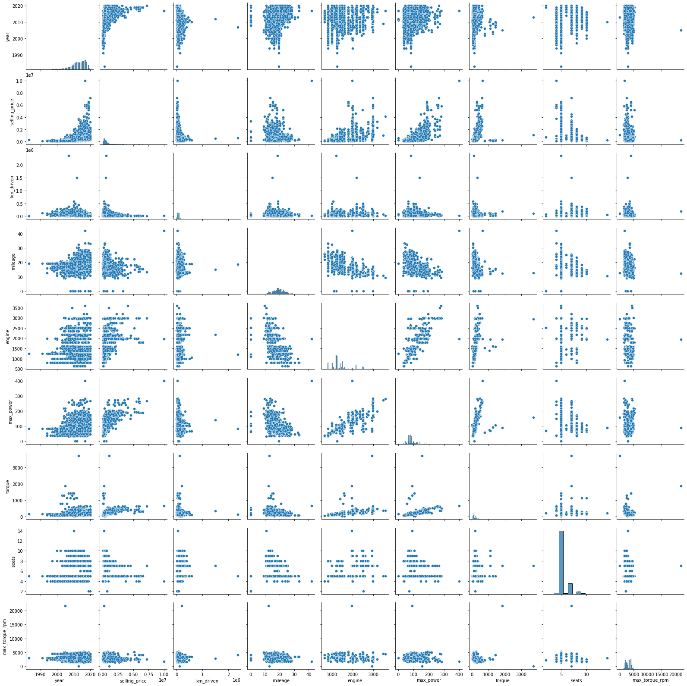
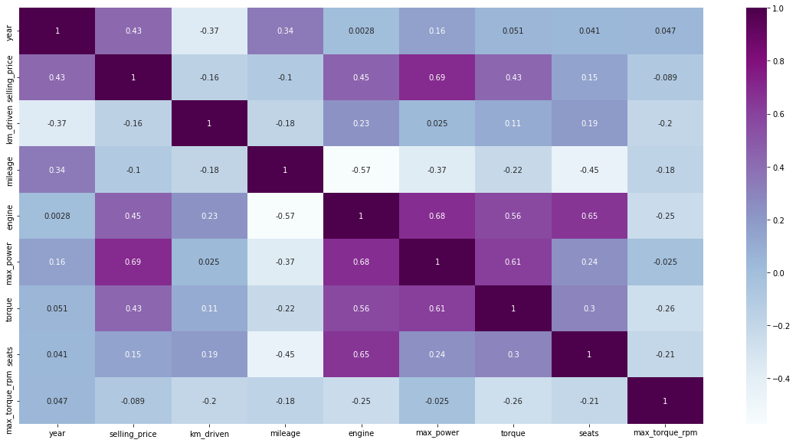
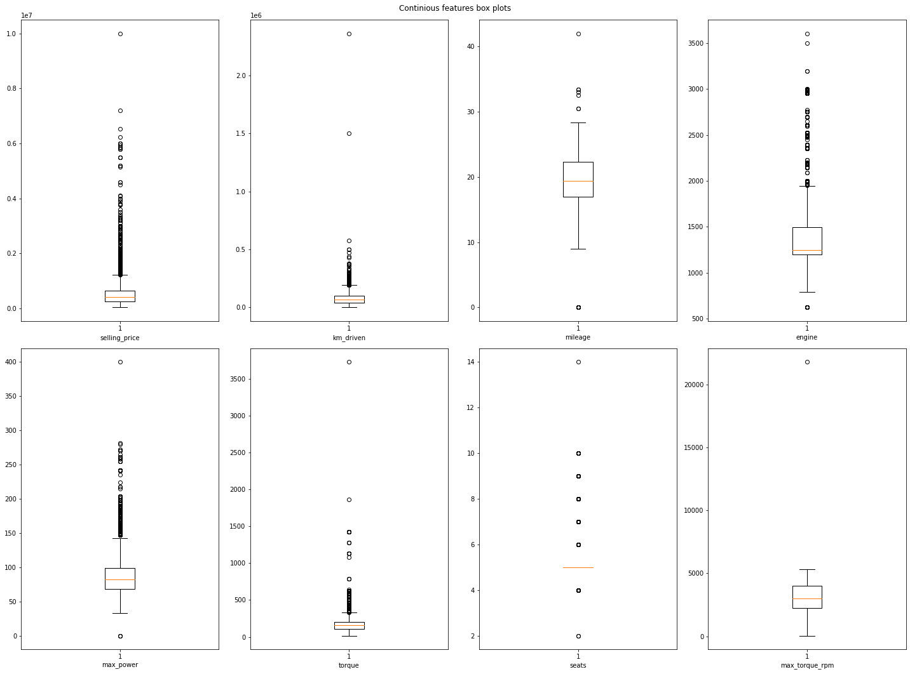

# Regression with inference

Модель регрессии для предсказания стоимости автомобилей, а также веб-сервис для применения построенной модели на новых данных.

## Структура репозитория

``HW1_Regression_with_inference.ipynb`` - ноутбук с аналитической частью, обучением моделей и тестированием сервиса 
``main.py`` - файл с реализацией сервсиа FastAPI  

``encoder.pkl`` - энкодер 
``medians`` - медиана 
``scaler.sav`` - скейлер 
``model`` - модель 

`test_csv_api.csv` - тестовый датасет без целевой переменной для тестирования api 
 
Испоользуемые в README визуализации:  
`image.png`  
`image-1.png` 
`image-2.png` 

## Данные

[Тренировочный](https://raw.githubusercontent.com/hse-mlds/ml/main/hometasks/HT1/cars_train.csv) и [тестовый](https://raw.githubusercontent.com/hse-mlds/ml/main/hometasks/HT1/cars_test.csv) датасеты, используемые для обучения сожержат данные об автомобилях:

``name`` - полное название автомобиля  
``year`` - год (покупки?)  
``selling_price`` - цена продажи 
``km_driven`` - пробег (км) 
``fuel`` - тип топлива  
``seller_type`` - тип продавца 
``transmission`` - трансмиссия  
``owner`` - владелец (по счету)  
``mileage`` - пробег(км\литр) 
``engine`` - объем двигателя 
``max_power`` - кол-во лошадиных сил  
``torque`` - момент двигателя 
``seats`` - кол-во сидений 

## Pipeline

**Цель:** предсказать стоимость машины по набору выше описанных признаков.  

Примерный pipeline:
1. Препроцессинг тренировочного и тестового датасета
2. Разведочный анализ данных (EDA)
3. Создание новых признаков
4. Обучение моделей + подбор гиперпараметров
5. Выбор модели и реализация предсказания через FAST API

## Препроцессинг

1. Удалены дубликаты 
2. Признаки ``mileage, engine, max_power`` очищенны от единиц измерений и приведены к формиату ``float``
3. Признак ``torque`` разделен на два признака: `torque` и `max_torque_rpm` и тоже приведен к формату `float`
4. Пропущенные значения (в т.ч. пустые строки) заполнены соответсвующими медианами тренировочного датасета
5. Признаки `engine`, `seats` приведены к формату `int`
6. Все численные признаки были стандартизированы перед обучением.
7. Получены два новых признака: произведение признаков `torque` и `max_torque_rpm` реализованное в новом признаке `torque_new`, а также категорияльная переменная `brand`, полученная из значений `name`.
8. Все категориальные признаки были закодированный OneHot энкодингом.

## EDA
Изучены распределения признаков и их корреляция.    
Попарные распределения (тренировочный датасет):

 

  
Матрица корреляций:

 

По обоим графикам видно влияние признака `max_power`, а так же отмечаются связи и внутри объясняющих переменных.  

Так же был проведен визуальный анализ выбросов.   
Бокс-плоты:

 
Видно большое количество выбросов в практически каждой переменной. 

Далее в процессе обучения моделей была предпринята попытка избавиться от самых вопиющих выбросов, использую квантили, однако она не привела к улучшению метрик, а скорее наоборот. Поэтому итоговая (лучшая) модель была обучена на полных данных.

## Train, test and compare models

### Линейная регрессия 
Обучена линейная регрессия на вещественных признаках с гиперпараметрами по умолчанию. Получены следующие метрики:  

**Train R-squared:** 0.542 
**Train MSE:** 131383530677 
**Test R-squared:** 0.57 
**Test MSE:** 247334171297.6 
 
Наибольшим (и значимым!) коэффициентом обладает признак `max_power` (большое влияние было замечено еще на этапе визуализации): при повышении значения этого признака на 1 ед. цена автомобиля вырастает на 375442 (доллара?) 

Дополнительно были отсмотрены значимости признаков и переменные `torque` и `seats`оказались незначимыми на любом разумном уровне значимости.

### Lasso-регрессия

Обучена Lasso-регрессия на вещественных признаках с гиперпараметрами по умолчанию. L1-регулярищзация не занулила веса с alpha=1, а метрики остались теми же, что и в линейной регресси (что само собой разумеется).
Далее с помощью GridSearch был подобран оптимальный параметр `alpha` = 901, который тем не менее также не занулил ни один признак и даже немного снизил метрики. 

### Ridge-регрессия + категориальные признаки

[здесь пропущены результаты обучения Ridge с последовательным добавлением новых фичей, ниже приведены результаты финальной модели со ВСЕМИ категориальными признаками] 

Обучена Ridge-регрессия на вещественных и закодированныхъх с помощью OneHot категориальных признаках. Было подобрано оптимальное значение `alpha` = 10.
Добавление категориальных признаков (и конечно, использование именно Ridge) произвело наибольший буст в метриках:

**Train R-squared:** 0.69 
**Train MSE:** 90278425177.4 
**Test R-squared:** 0.71 
**Test MSE:** 168819519871.4 

## API for predictions

Реализован сервис на FastAPI, который реализует две функции:
1. на вход в формате json подаются признаки одного объекта, на выходе сервис выдает предсказанную стоимость машины
2. на вход подается список json с признаками тестовых объектов, на выходе получаем список предсказаний на этих объектах
 

Сервис реализован в файле `main.py`. Работу сервиса я проверяла прямо в основном .ipynb файле (в самом конце) через библиотеку `requests` и сравнивала с изначальными предсказаниями на тесте.

## Что нас не убивает - делает нас сильнее
### Трудности, с которыми я столкнулась, и штуки, которые не смогла (не успела) реализовать

- Из-за недостатка времени не успела поглубже проанализировать выбросы, попробовать разные методы их выявления. Очень вероятно применение верного метода смогло бы увеличить качество модели. 
- В том же разделе Feature Engeneering была идея реализовать факторный анализ для скоррелированных признаков (например, mileage и engine, max_power и engine и др. ), которая не вопрлотилась в реальность.
- Совершено открытие: стандартизировать целевую переменную мождет быть опасно занулением всех коэффициентов при признаках с использованием регуляризации.

